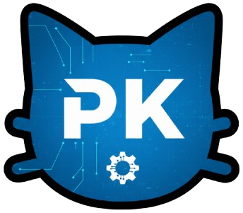

# ScriptCat Sync Workspace



[🇫🇷 FR](README.md) · [🇬🇧 EN](README_en.md)

✅ Solution complète de synchronisation bidirectionnelle de userscripts entre VS Code et ScriptCat.

## 📁 Structure du projet

```
├── /snippets/              # Tous vos userscripts
│   └── github_license_stickers.user.js
├── /extensions/vscode/
│   ├── /src/             # Source de l'extension VS Code
│   └── /release/         # Version buildée/prête à publier
│       ├── extension.js  # ✅ PRÊT
│       ├── icon.png     # ✅ PRÊT  
│       └── package.json  # ✅ PRÊT
├── /extensions/chrome/
│   ├── /src/             # Source de ScriptCat (modifié)
│   └── /release/         # Versions buildées de Scriptcat
│       ├── simple_manifest.json      # ✅ PRÊT
│       ├── service_worker_sync.js    # ✅ PRÊT
│       ├── popup.html                # ✅ PRÊT
│       └── README_INSTALL.md         # ✅ PRÊT
└── README.md
```

## ✅ Fonctionnalités

- 🔁 **Synchronisation bidirectionnelle** complète
- 📤 **Push** automatique des scripts locaux vers ScriptCat
- 📥 **Pull** automatique des scripts depuis ScriptCat  
- 🔄 **Sync en temps réel** via WebSocket
- 🗂️ **Organisation par préfixes** (github_, reddit_, etc.)
- ⚙️ **Configuration flexible** port et auto-connect

## 🧠 Utilisation

### 1. Installation VS Code Extension
```bash
# Utiliser les fichiers de extensions/vscode/release/
# extension.js, icon.png, package.json
```

### 2. Installation Chrome Extension  
```bash
# Aller à chrome://extensions/
# Activer "Mode développeur"
# "Charger décompressé" et sélectionner extensions/chrome/release/
```

### 3. Configuration
- **Port WebSocket** : 8642 (configurable)
- **Auto-connect** : Activé par défaut
- **Dossier scripts** : `/snippets/`

## 🧾 Commands VS Code

- **ScriptCat: Start Server** : Lance le serveur WebSocket
- **ScriptCat: Stop Server** : Arrête le serveur WebSocket  
- **ScriptCat: Push Current Script** : Pousse le script actuel
- **ScriptCat: Sync All Scripts** : Synchronisation complète bidirectionnelle ⭐
- **ScriptCat: Request Missing Scripts** : Récupère les scripts manquants ⭐

## 📡 Communication WebSocket

```typescript
interface Message {
  type: 'script_list' | 'script_update' | 'script_delete' | 'sync_all';
  data?: any;
  timestamp?: number;
}
```

## 🎯 Test de la synchronisation

1. **Démarrer VS Code** avec un workspace contenant des `.user.js`
2. **Ouvrir l'extension Chrome** - devrait se connecter automatiquement
3. **Ajouter/modifier un script** dans VS Code → devrait apparaître dans ScriptCat
4. **Ajouter un script** dans ScriptCat → devrait apparaître dans VS Code
5. **Utiliser les commandes** de synchronisation complète

## 🧾 Changelog

- **1.0.0** : ✅ Structure refactorisée, synchronisation bidirectionnelle PRÊTE
- **0.1.2** : Correction de bugs et améliorations de stabilité
- **0.1.1** : Ajout de la configuration autoConnect
- **0.1.0** : Version initiale avec synchronisation de base

## 🔗 Liens

- EN README : README_en.md
- Extension ScriptCat : [scriptcat.org](https://scriptcat.org/)
- Documentation VS Code : [code.visualstudio.com](https://code.visualstudio.com/)
