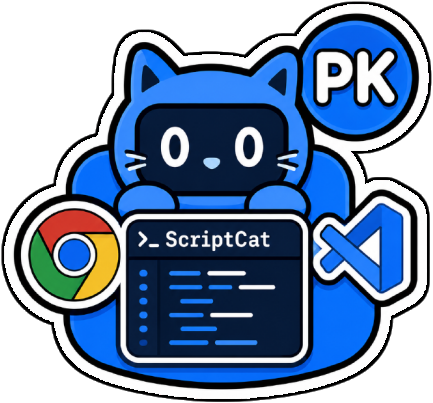

# VS_PKscriptcat_snippets



[🇬🇧 EN](README_en.md) · [🇫🇷 FR](README.md)

✨ Complete bidirectional synchronization solution for userscripts between VS Code and ScriptCat, with a collection of ready-to-use snippets.

## ✅ Features

- 🔁 **Complete bidirectional synchronization** between VS Code and ScriptCat
- 📤 **Automatic push** of local scripts to ScriptCat
- 📥 **Automatic pull** of scripts from ScriptCat
- 🔄 **Real-time sync** via WebSocket
- 🗂️ **Prefix-based organization** (pk-gmail, pk-github, pk-css, etc.)
- ⚙️ **Flexible configuration** : customizable port and auto-connect
- 📦 **50+ included snippets** : optimized userscripts for Gmail, GitHub, GG.deals, etc.

## 📚 Snippets Collection

### 🤖 ChatGPT (5 scripts)

| Script | Description |
|--------|-------------|
| `pk-chatgpt-multi-pin-answers` | Pin multiple answers per ChatGPT conversation with side panel |
| `pk-chatgpt-sidebar-pin` | Pin conversations in ChatGPT sidebar, pinCHAT style |
| `pk-chatgpt-read-aloud` | Voice reading of ChatGPT responses |
| `pk-read-aloud-chatgpt` | 🗣️🔄⏹️ buttons to read prose elements aloud |
| Versions v2-v5 | Progressive variants (navigation, grouping, sources) |

### 📧 Gmail - Core Scripts (8 scripts)

| Script | Description |
|--------|-------------|
| `pk-gmail-custom-tabs` | Add 3 custom tabs to filter emails by labels |
| `pk-gmail-filter-similar-always-visible` | Persistent icon button for "Filter similar messages" |
| `pk-gmail-icon-view` | Finder-style icon view for Gmail |
| `pk-gmail-bouton-inbox-vue-liste-strict` | Show "New message" only in inbox list view |
| `pk-gmail-new-message-button` | "New message" button next to Gmail logo |
| `pk-gmail-no-spam-icon` | Validation icon when no spam |
| `pk-gmail-sender-icons` | Display sender favicons in Gmail |
| `pk-gmail-a-filtrer-les-messages-similaires` | Add "Filter similar" button to toolbar |

### 🎨 Gmail - CSS/Styling (20 scripts)

| Script | Description |
|--------|-------------|
| `pk-css-gmail-white-style` | Pure white Gmail interface |
| `pk-css-gmail-full-white` | Full white mode Gmail |
| `pk-css-gmail-margin` | Gmail margin adjustments |
| `pk-css-gmail-no-left-menu` | Hide Gmail left menu |
| `pk-css-gmail-scrollbar-grey` | Elegant grey scrollbar Gmail |
| `pk-css-gmail-search-bar-center-white` | Centered white search bar |
| `pk-css-gmail-stars-focus` | Highlight Gmail stars |
| `pk-css-gmail-sticky-topic` | Sticky subject in Gmail |
| `pk-css-gmail-top-right-buttons` | Top right buttons Gmail |
| `pk-css-gmail-unread-color` | Custom color for unread emails |
| Versions `pk-css-pk-gmail-*` | Auto-generated CSS injectors for above styles |

### 🐙 GitHub (2 scripts)

| Script | Description |
|--------|-------------|
| `pk-github-license-stickers` | Highlight GitHub licenses as colorful stickers |
| `pk-github-license-stickers-alt` | Alternative version of license stickers |

### 🎮 GG.deals (3 scripts)

| Script | Description |
|--------|-------------|
| `pk-ggdeals-grid-view` | Display GG.deals new deals in grid layout |
| `pk-gg-deals-new-deals-grid-view-corrected` | Corrected version of GG.deals grid |
| `pk-css-ggdeals-colors` | Improve GG.deals icon and background colors |

### 💼 LinkedIn (1 script)

| Script | Description |
|--------|-------------|
| `pk-css-linkedin-width` | Adjust LinkedIn width and hide sidebar |

### 🛠️ Utilities (5 scripts)

| Script | Description |
|--------|-------------|
| `pk-unsuspend-url-from-clipboard` | Decode suspended URLs from clipboard |
| `pk-unsuspend-url-the-great-suspender-similar` | Extract and open real URLs from suspended.html |
| `pk-utils-unsuspend-current-page` | Current page version of unsuspender |
| `pk-utils-unsuspend-from-clipboard` | Clipboard version of unsuspender |
| `pk-css-main` | Main auto-generated CSS injector |

## 🧠 Usage

### VS Code Extension Installation

```bash
# Use files from extensions/vscode/release/
# extension.js, icon.png, package.json
```

### Chrome Extension Installation

```bash
# Go to chrome://extensions/
# Enable "Developer mode"
# "Load unpacked" and select extensions/chrome/release/
```

### Workflow

1. **Start VS Code** with a workspace containing `.user.js` files
2. **Open the Chrome extension** — it connects automatically
3. **Add/edit a script** in VS Code → appears in ScriptCat
4. **Add a script** in ScriptCat → appears in VS Code

## ⚙️ Settings

Configure options in `File > Preferences > Settings` :

- `scriptcat-sync.port`: WebSocket port for ScriptCat connection (default: 8642)
- `scriptcat-sync.autoConnect`: Auto-start server when opening workspace with userscripts (default: true)
- **Scripts folder**: `/snippets/` (project root)

## 🧾 Commands

- **ScriptCat: Start Server**: Start WebSocket server
- **ScriptCat: Stop Server**: Stop WebSocket server
- **ScriptCat: Push Current Script**: Push current script to ScriptCat
- **ScriptCat: Sync All Scripts**: Complete bidirectional synchronization ⭐
- **ScriptCat: Request Missing Scripts**: Retrieve missing scripts ⭐

## 📦 Build & Package

```bash
npm install
vsce package
```

## 🧪 Install (Antigravity)

```bash
code --install-extension Cmondary.vs-pkscriptcat-snippets
```

## 🧾 Changelog

- **1.0.0**: ✅ Refactored structure, bidirectional sync READY
- **0.1.2**: Bug fixes and stability improvements
- **0.1.1**: Added autoConnect configuration
- **0.1.0**: Initial release with basic sync functionality

## 🔗 Links

- 🇫🇷 FR README : [README.md](README.md)
- 🔗 ScriptCat Extension : [scriptcat.org](https://scriptcat.org/)
- 📚 VS Code Documentation : [code.visualstudio.com](https://code.visualstudio.com/)
